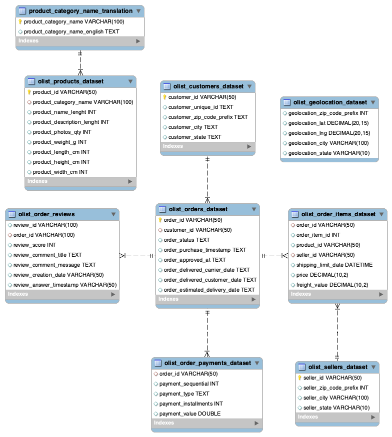

# 📊 Olist E-Commerce Analysis & Dashboard

  
   
  
<i>A comprehensive data analysis and web-based dashboard for Brazilian E-Commerce data.</i>

---

## 🌍 Language / Dil Seçimi

<b>🇹🇷 Türkçe Proje Detayları (Tıkla/Expand)</b>

### 📌 Proje Hakkında
Bu proje, Brezilya'nın en büyük e-ticaret platformu olan **Olist**'e ait gerçek verilerin analiz edilmesini ve bu analizlerin **Streamlit** kullanılarak web tabanlı bir dashboard'a dönüştürülmesini kapsar.

### 🚀 Özellikler
* **Veri Temizleme:** Eksik ve hatalı verilerin Pandas ile manipülasyonu.
* **Görselleştirme:** Seaborn ve Matplotlib ile satış trendleri ve müşteri dağılımı.
* **Etkileşim:** Streamlit ile kullanıcı dostu arayüz.

### 🛠️ Kurulum
1. Bu depoyu klonlayın.
2. `pip install -r requirements.txt` komutuyla kütüphaneleri kurun.
3. `streamlit run olist.py` komutuyla uygulamayı başlatın.

 

<b>🇺🇸 English Project Details (Click/Expand)</b>

### 📌 About the Project
This project involves analyzing real-world data from **Olist**, the largest e-commerce platform in Brazil, and transforming these insights into a web-based dashboard using **Streamlit**.

### 🚀 Features
* **Data Cleaning:** Manipulation of missing and inconsistent data using Pandas.
* **Visualization:** Sales trends and customer distribution using Seaborn and Matplotlib.
* **Interactivity:** User-friendly interface built with Streamlit.

### 🛠️ Installation
1. Clone this repository.
2. Run `pip install -r requirements.txt`.
3. Launch the app with `streamlit run olist.py`.

---

## 🛠️ Tech Stack / Kullanılan Teknolojiler
* **Language:** Python 3.10+
* **Libraries:** Pandas, NumPy, Seaborn, Matplotlib, Streamlit
* **Database Logic:** Relational data mapping (SQL logic)

## 📞 Contact / İletişim
**Melih Yavuz** *Management Information Systems Student* https://www.linkedin.com/in/melih-yvuz/ | melih_yvuz@hotmail.com
