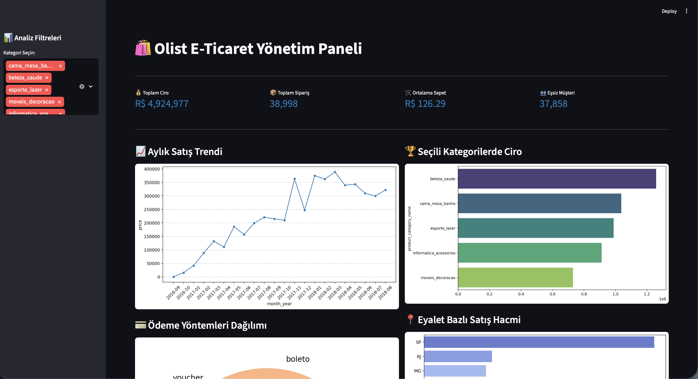
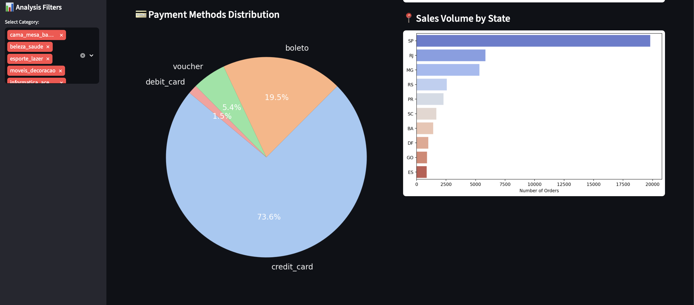

# 📊 Olist E-Commerce Analysis & Dashboard

  
   
  
<i>Brezilya E-Ticaret verileri (Olist) için kapsamlı veri analizi ve etkileşimli Streamlit yönetim paneli.</i>

---

## 🌍 Language / Dil Seçimi

<b>🇹🇷 Türkçe Proje Detayları (Tıkla/Genişlet)</b>

### 📌 Proje Hakkında
Bu çalışma, Kaggle üzerindeki gerçek **Olist** verileri kullanılarak hazırlanmıştır. Projenin amacı, bir e-ticaret işletmesinin satış trendlerini, müşteri dağılımını ve ödeme tercihlerini analiz ederek yönetilebilir bir panel sunmaktır.

### 📸 Uygulama Görünümü

  
   
  

### 🚀 Öne Çıkan Analizler
* **Aylık Satış Trendi:** Mevsimsel dalgalanmaların ve büyüme ivmesinin takibi.
* **Bölgesel Dağılım:** En çok satış yapılan eyaletlerin (SP, RJ, MG) hacimsel analizi.
* **Ödeme Analizi:** Kredi kartı (%73.6) ve Boleto (%19.5) kullanım oranları.
* **Kategori Performansı:** En çok ciro getiren ürün gruplarının tespiti.

### 🛠️ Kurulum
1. `git clone https://github.com/melihyvuz/Olist_Ecommerce_Analysis.git`
2. `pip install -r requirements.txt`
3. `streamlit run olist.py`

 

<b>🇺🇸 English Project Details (Click/Expand)</b>

### 📌 About the Project
This project utilizes real-world **Olist** e-commerce data to provide strategic insights. It covers the entire data pipeline: from relational mapping to visual storytelling via a **Streamlit** dashboard.

### 📸 App Preview
*(Refer to the screenshots above in the Turkish section for a visual overview)*

### 🚀 Key Analytics
* **Sales Trends:** Monitoring monthly revenue and order growth.
* **Geographic Insights:** Visualization of sales volume by state (SP, RJ, MG etc.).
* **Payment Preferences:** Deep dive into payment methods (Credit Card vs. Boleto).
* **Category Performance:** Revenue analysis across different product categories.

### 🛠️ Installation
1. `git clone https://github.com/melihyvuz/Olist_Ecommerce_Analysis.git`
2. `pip install -r requirements.txt`
3. `streamlit run olist.py`

---

## 🛠️ Tech Stack / Teknolojiler
* **Data:** Python, Pandas, NumPy
* **Visualization:** Seaborn, Matplotlib
* **Web App:** Streamlit
* **Environment:** MacBook (macOS)

## 📞 Contact / İletişim
**Melih Yavuz** *MIS Student* 🔗 [LinkedIn](https://www.linkedin.com/in/melih-yvuz/) | ✉️ [Email](mailto:melih_yvuz@hotmail.com)
